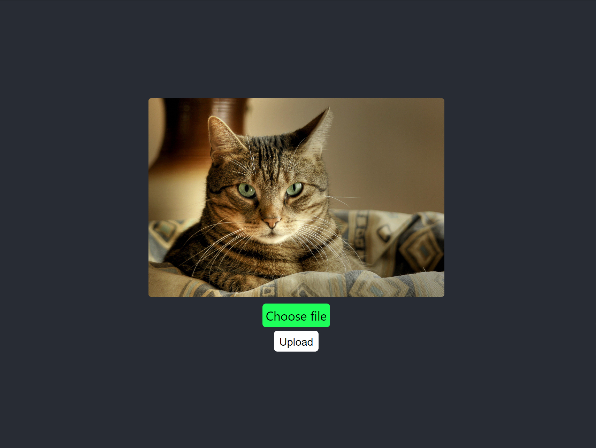
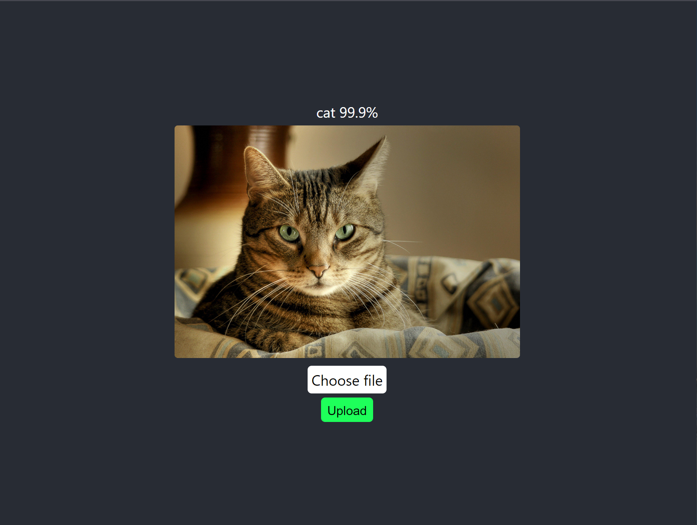

# cat_or_dog

- Website with integrated Convolutional Neural Network (CNN)&#129454;&#128008;
## &#128187; Clone project
### `git clone https://github.com/leviathan-code/cat_vs_dog.git`

## For frontend
### Install (in ..\frontend)
    npm install
### Activate
    npm start
    
## For backend &#128281;&#128282;
### [Install python3](https://www.python.org/downloads/)

### Creat a venv

    python3 -m venv .venv
## &#128267; Activation

### Windows
    .venv/Scripts/Activate.ps1
### Another os
    source .venv/bin/activate
### Install packages
    pip install -r requirements.txt
 ### Run the server (in ..\backend)
    python main.py
 Or
 
    py main.py

# Site appearance &#128421;&#128293;

